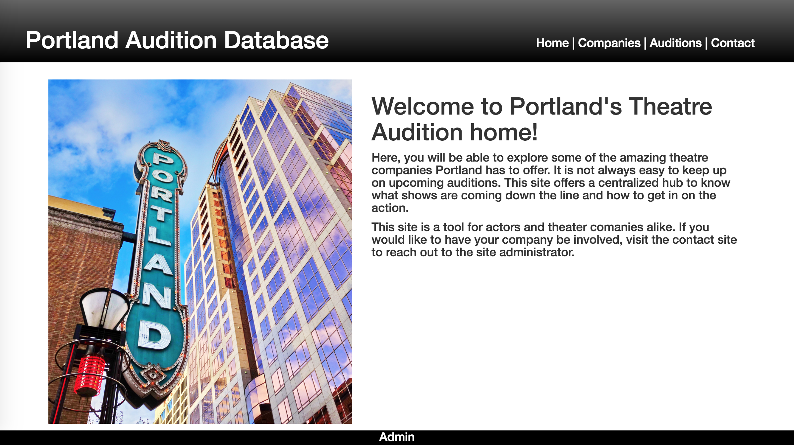
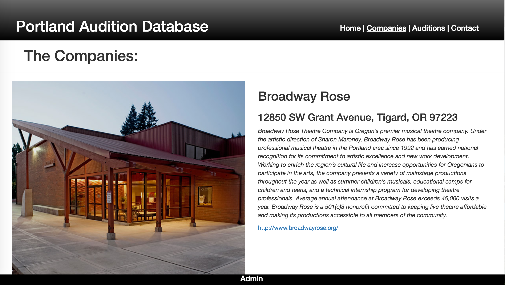
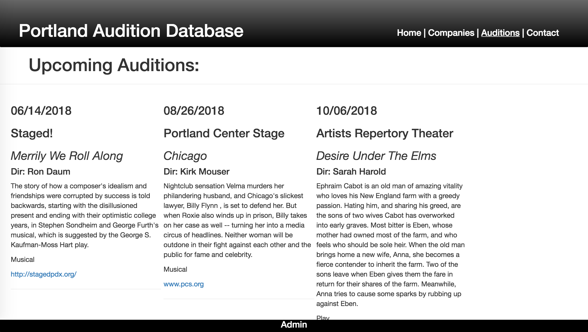
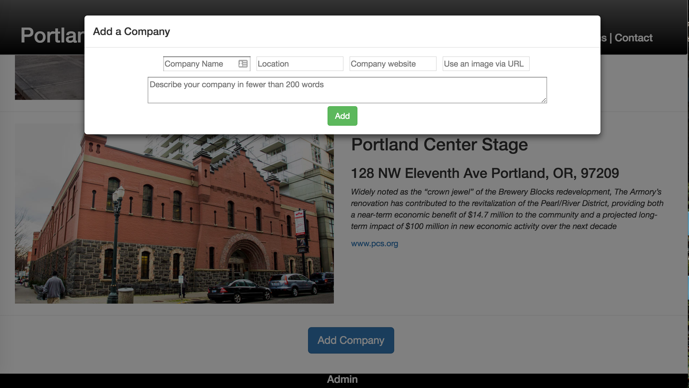

# Portland Audition Database

#### _Epicodus Capstone Project, September 6th, 2017_
**_By Brittany Kerr, Calla Rudolph, Max Scher, Larry Taylor, and Michelle Poterek_**

## Description
As of now, there is no centralized hub of audition information for Portland's theater scene. This means that actors have a hard time knowing what shows are coming up and how to get involved. This app provides a place for theater companies to display information about theselves, as well as upcoming auditions all in one place.

##  Program Preview

_Home Page_


_Theater companies can submit their information to be displayed in our list of partner companies._


_Theater companies can submit info for their upcoming auditions._


_User information is input through form modals._

## Installation Instructions
* Open Terminal and type:
* `$ cd Desktop`
* `$ git clone https://github.com/larryjtaylor/Portland-auditions.git`
* `$ cd Portland-auditions`
* `$ npm install`
* `$ atom .`

### Firebase Configuration
* First off, you'll need to make a free account at Firebase's website. [Firebase](https://www.learnhowtoprogram.com/javascript/angular-extended/firebase-introduction-and-setup)
* Create a New Project. Select this option, provide a name for your new project, and select your Country/region from the drop-down menu.
* Select Add Firebase to your web app.
* In the project, make a file called: **src/app/apiKeys.js**
* paste the code below into your api-keys.ts file.

````
export var masterFirebaseConfig = {
    apiKey: "xxxx",
    authDomain: "xxxx.firebaseapp.com",
    databaseURL: "https://xxxx.firebaseio.com",
    storageBucket: "xxxx.appspot.com",
    messagingSenderId: "xxxx"
  };

````
* With the information provided in the modal, replace the "xxxx" variables with your own firebase credentials in your apiKeys.js file.

### Serving Program
* Be sure to save these changes in your code text editor (Atom).
* In Terminal, run `$ npm start`
* In your Browser (Chrome preferred) navigate to [http://localhost:8080/](http://localhost:8080/)


## Technologies Used
* React.js
* NodeJS
* Redux.js
* JSX
* Firebase
* Bootstrap, CSS, and HTML
* Jest.js
* Middleware
* Flux


## Wish List
* New company and audition creation will be moved to Admin component.
* Auditions will be displayed in React component "React-Big-Calendar."
* Company addresses will be displayed on a Google map with Google Map API.
* Admin will have user authentication to limit creation and deletion access.

## Support and contact details
Please feel empowered to make any changes to this repository by forking it and making changes accordingly.

## License Information
This web application is free to use under the MIT License &copy; Larry Taylor.

----
